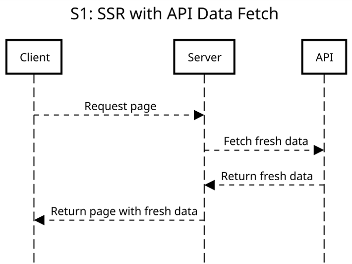
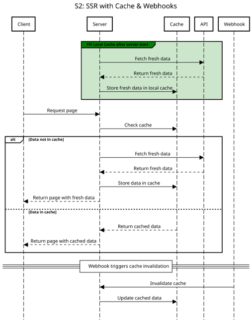
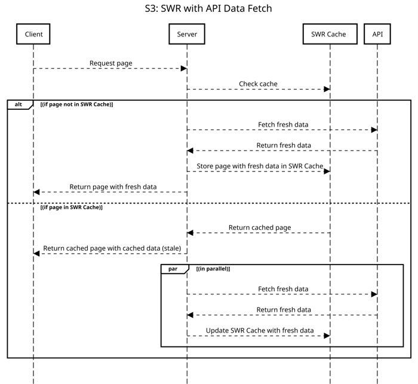
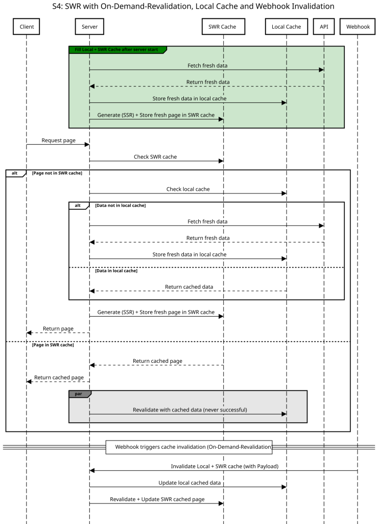

# Architektur & Strategien
Dieses Dokument beschreibt die Architektur des Prototyps sowie die Unterschiede der vier Strategien (S1–S4) anhand von Abläufen und Sequenzdiagrammen. Jede Strategie zeigt den Ablauf beim Besuch der jeweiligen Seite, einschließlich API-Abfrage, Cache-Nutzung, SSR/Client-Rendering und Webhook-Aktualisierung.

---

## Übersicht
Alle Strategien greifen auf die **Shopify Storefront API (GraphQL)** zu, um die Produktliste zu laden.  
Der Unterschied liegt in der **Renderingmethode (SSR oder SWR)** und der **Datenhaltung / Aktualisierung**.  

---

## Strategien

### S1 – SSR mit direkter API-Abfrage
- Bei jedem Request → API-Abfrage → Seite wird per SSR gebaut → direkt ausgeliefert.  

**Sequenzdiagramm:**  
  

---

### S2 – SSR mit Cache + Webhooks
- API-Daten werden serverseitig gecached.  
- Requests nutzen den Cache → schnellere SSR-Auslieferung.  
- Änderungen im Backend lösen per **Webhook** eine Cache-Aktualisierung aus.  

**Sequenzdiagramm:**  
  

---

### S3 – SWR (Stale-While-Revalidate)
- Erster Aufruf: SSR + API-Abfrage → Ergebnis im SWR-Cache gespeichert.  
- Folgeaufrufe: Seite wird direkt aus Cache ausgeliefert.  
- Parallel: API-Abfrage im Hintergrund → Cache wird aktualisiert.  
- Risiko: kurzfristig **stale Daten**.  

**Sequenzdiagramm:**  

---

### S4 – Erweiterte SWR-Strategie
- Initial: Seite wird beim Serverstart gebaut und direkt im SWR-Cache gespeichert.  
- Requests: direkte Auslieferung aus Cache (kein SSR nötig).  
- Webhooks sorgen für sofortige Cache-Aktualisierung → **keine stale Versionen**.  

**Sequenzdiagramm:**  
  

---

## Sequenzdiagramme der Strategien
Die Diagramme veranschaulichen die Abläufe beim Besuch der jeweiligen Seite, inklusive Interaktion der Komponenten Client, Server, SWR-Cache, Local-API-Cache, API und Webhook.