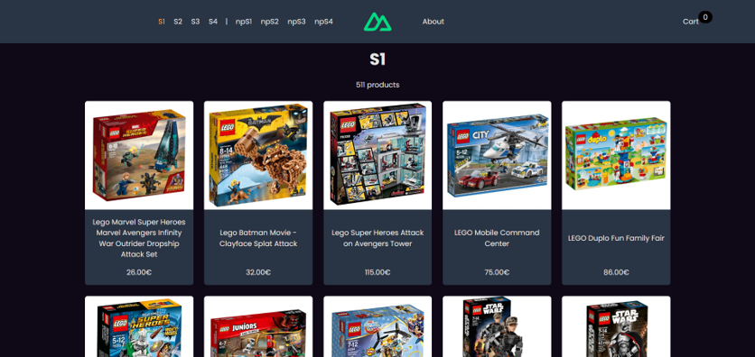
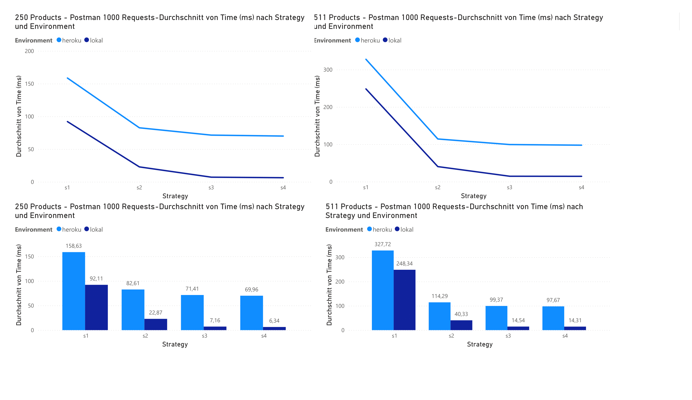
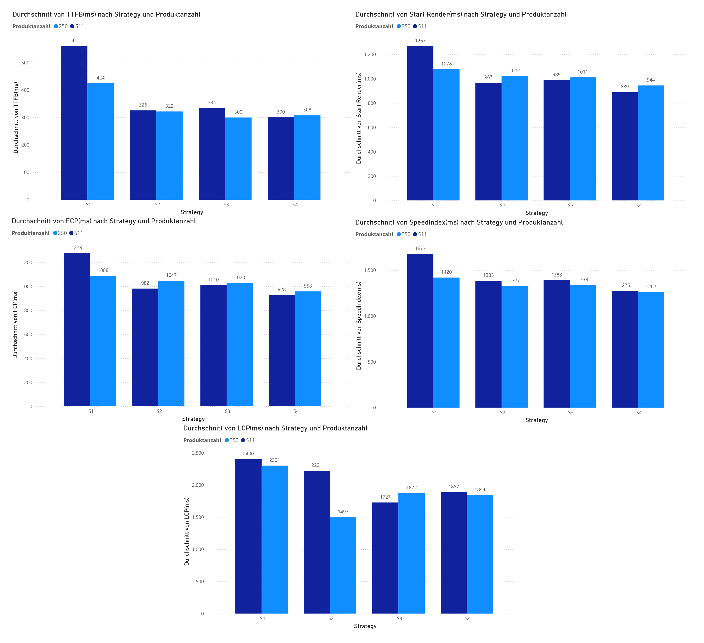

# Headless E-Commerce Performance Prototype

Ein **Nuxt 3**-basierter Prototyp zur Untersuchung verschiedener **Datenabfragestrategien** im Headless-E-Commerce mit der **Shopify Storefront API**.  
Im Fokus stehen **Performance-Optimierung** und **Datenaktualität** durch moderne Rendering- und Caching-Techniken.  
Entstanden im Rahmen meiner **Bachelorarbeit** in Informatik.

---

## 🚀 Live Demo

👉 [Demo öffnen](https://bsc-prototype-nuxt-storefront.netlify.app/)

Jede Strategie ist unter einer eigenen Route erreichbar:

-   `/s1` → SSR mit direkter API-Abfrage
-   `/s2` → SSR mit API-Daten-Cache + Webhooks
-   `/s3` → SWR (Stale-While-Revalidate)
-   `/s4` → SWR + On-Demand-Revalidation + Cache + Webhooks

👉 Abläufe und Sequenzdiagramme siehe [ARCHITEKTUR.md](./ARCHITEKTUR.md)

---

## 📸 Screenshots

Produktliste (Nuxt 3 + Shopify API):



---

## 📌 Features

-   Vergleich von **SSR & SWR Strategien**
-   **Caching & Webhooks** zur Optimierung von Antwortzeiten und Datenaktualität
-   **On-Demand-Revalidation**: gezielte Aktualisierung des SWR-Caches bei Änderungen im Backend
-   **Performance-Messungen** mit:
    -   Postman (avg. response time)
    -   WebPageTest (TTFB, FCP, LCP, SpeedIndex etc.)
-   **Klar getrennte Routen je Strategie** (`/s1` – `/s4`) für reproduzierbare Tests
-   **Typische Shop-Funktionalitäten:** Produktliste, Detailseiten, Warenkorb

---

## 🛠️ Tech Stack

-   **Frontend**: Nuxt 3 (SSR, SWR, Cache)
-   **Styling**: TailwindCSS
-   **API**: Shopify Storefront API (GraphQL)
-   **Deployment**: Google Cloud Run (CI/CD Deployment bei Push auf main)
-   **Messungen**: Postman, WebPageTest
-   **Lokale Entwicklung**: ngrok für Webhooks

---

## 📈 Performance Results (Auszug)

Die Messungen zeigen **deutliche Verbesserungen von S1 → S4**:

| Dataset      | Metric | S1 → S4           | Improvement       |
| ------------ | ------ | ----------------- | ----------------- |
| 250 Produkte | TTFB   | 424 ms → 308 ms   | **27% (-116 ms)** |
|              | LCP    | 2301 ms → 1844 ms | **20% (-457 ms)** |
| 511 Produkte | TTFB   | 561 ms → 300 ms   | **47% (-261 ms)** |
|              | LCP    | 2400 ms → 1887 ms | **21% (-513 ms)** |

👉 Besonders **S4 (SWR + On-Demand-Revalidation + Cache + Webhooks)** liefert die beste Kombination aus **Performance & Datenaktualität**.

  


👉 Vollständige Ergebnisse und Analysen siehe [RESULTS.md](./RESULTS.md).

---

## 🧪 Testaufbau

Alle Strategien rufen die Produktliste über die Shopify Storefront API ab.  
Der Unterschied liegt in der **Renderingmethode (SSR oder SWR)** sowie in der **Datenhaltung und Aktualisierung**:

-   **S1 (SSR)**  
    Bei jedem Seitenaufruf: API wird abgefragt → Seite per SSR gebaut → direkt ausgeliefert.

-   **S2 (SSR + Cache + Webhooks)**  
    API-Daten werden auf dem Server gecached → Seite kann sofort mit Cache-Daten per SSR gebaut werden.  
    Änderungen im Backend triggern per Webhook eine Cache-Aktualisierung.

-   **S3 (SWR)**  
    Beim ersten Aufruf: API-Abfrage + SSR-Bau → Ergebnis wird ausgeliefert + im SWR-Cache gespeichert.  
    Folgeaufrufe: Seite wird sofort aus SWR-Cache ausgeliefert, während im Hintergrund die API neu abgefragt und der Cache aktualisiert wird (**Gefahr veralteter Daten**).

-   **S4 (SWR erweitert)**  
    Nach Serverstart wird die Seite initial gebaut und im SWR-Cache gespeichert.  
    Folgeaufrufe: direkte Auslieferung aus SWR-Cache (kein Warten auf SSR).  
    Aktualität wird über **Webhooks** sichergestellt → Änderungen im Backend triggern sofort eine SWR-Cache-Aktualisierung (**keine stale Versionen**).

**Performance-Messungen:**

-   **Serverseitig (Postman):** 1000 Anfragen pro Strategie, lokal & gehostet → durchschnittliche Response Times.
-   **Clientseitig (WebPageTest):** 9 Testläufe pro Strategie → Performance-Metriken (TTFB, Start Render, FCP, LCP, Speed Index).

👉 Details zu Testbedingungen, Datensätzen (250 vs. 511 Produkte) und Sequenzdiagrammen siehe [TESTING.md](./TESTING.md).

---

## ⚡ Installation & Setup

### 🔑 Environment Variables

Erstelle eine `.env`-Datei mit den Shopify-Credentials:

```env
NUXT_PUBLIC_STORE_URL=https://YOUR-STORE-ADDRESS.myshopify.com
NUXT_PUBLIC_STOREFRONT_ACCESS_TOKEN=YOUR-STOREFRONT-API-ACCESS-TOKEN

# Für Webhooks (nur nötig bei S2/S4):
NUXT_ADMIN_API_URL=https://YOUR-STORE-ADDRESS.myshopify.com/admin/api/
NUXT_ADMIN_API_ACCESS_TOKEN=YOUR-ADMIN-API-ACCESS-TOKEN
```

Für lokale Entwicklung mit Webhooks:

```env
NGROK_AUTHTOKEN=YOUR-NGROK-AUTHTOKEN
```

#### Lokale Entwicklung mit Webhooks

Nur im **DevMode** nötig, z. B. für `/products3` (SSR mit Cache) und `/products4` (SSG):

```env
NGROK_AUTHTOKEN=YOUR-NGROK-AUTHTOKEN

# Optional: erzwingt die Nutzung von ngrok anstelle von NUXT_DEPLOY_URL
NUXT_FORCE_NGROK_URL=http://localhost:3000
```

#### Produktion

Für die Nutzung von Webhooks in der Produktionsumgebung:

```env
NUXT_DEPLOY_URL=YOUR-DEPLOY-URL
```

> Hinweis: Die `.env`-Datei wird je nach Modus (Dev/Production) unterschiedlich benötigt.

---

### Setup & Run

```bash
# Repo klonen
git clone https://github.com/timbkr/bsc-prototype-nuxt-storefront.git
cd bsc-prototype-nuxt-storefront

# Abhängigkeiten installieren
npm install

# Dev-Server starten
npm run dev

# Produktion builden
npm run build
npm run preview
```

---

## 📖 About

Dieses Projekt entstand als **Prototyp im Rahmen meiner Bachelorarbeit**.  
Ziel war es, unterschiedliche Datenabfragestrategien zu vergleichen und deren Einfluss auf **Performance** und **Datenaktualität** zu evaluieren.

Die Ergebnisse zeigen, dass **Caching und Webhooks** im E-Commerce entscheidende Vorteile für Ladezeiten und Nutzererfahrung bringen.

---
