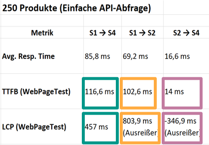
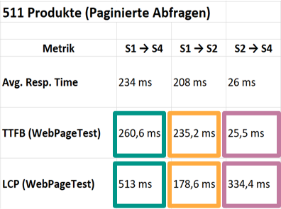

# 📊 Ergebnisse

Dieses Dokument fasst die **Messergebnisse** der Performance-Tests zusammen. Getestet wurden die vier Strategien **S1–S4** mit zwei verschiedenen Datensätzen (250 und 511 Produkte).

👉 Details zu Testbedingungen, Datensätzen (250 vs. 511 Produkte) und Sequenzdiagrammen siehe [TESTING.md](./TESTING.md).

---
## 🔎 1. Postman (Serverseitige Antwortzeiten)

Gemessen: **Durchschnittliche Response Time** (1000 Requests pro Strategie).

| Produkte | Strategie | Lokal (ms) | Heroku (ms) |
| -------- | --------- | ---------- | ----------- |
| 511      | S1        | 248,3      | 327,7       |
|          | S2        | 40,3       | 114,3       |
|          | S3        | 14,5       | 99,4        |
|          | S4        | 14,3       | 97,7        |
| 250      | S1        | 92,1       | 158,6       |
|          | S2        | 22,9       | 82,6        |
|          | S3        | 7,2        | 71,4        |
|          | S4        | 6,3        | 70,0        |

---

## 🌍 2. WebPageTest (Clientseitige Performance)

Gemessen: **TTFB, Start Render, FCP, SpeedIndex, LCP** (9 Testläufe pro Strategie, Durchschnittswerte).

| Metrik                | Produkte | S1     | S2     | S3     | S4     |
| --------------------- | -------- | ------ | ------ | ------ | ------ |
| **TTFB (ms)**         | 511      | 560,8  | 325,6  | 334,1  | 300,1  |
|                       | 250      | 424,2  | 321,6  | 299,6  | 307,6  |
| **Start Render (ms)** | 511      | 1266,7 | 966,7  | 988,9  | 888,9  |
|                       | 250      | 1077,8 | 1022,2 | 1011,1 | 944,4  |
| **FCP (ms)**          | 511      | 1279,0 | 981,9  | 1010,1 | 928,4  |
|                       | 250      | 1088,4 | 1047,3 | 1028,2 | 958,0  |
| **SpeedIndex (ms)**   | 511      | 1677,2 | 1385,4 | 1388,3 | 1275,1 |
|                       | 250      | 1419,7 | 1327,3 | 1338,7 | 1261,9 |
| **LCP (ms)**          | 511      | 2400,0 | 2221,4 | 1727,3 | 1887,0 |
|                       | 250      | 2300,6 | 1496,7 | 1872,3 | 1843,6 |

---

## 📈 Verbesserungen S1 → S4

Die folgenden Werte zeigen die **konkreten Verbesserungen** beim Vergleich der Basisstrategie (S1) zur optimierten Strategie (S4):

| Dataset       | Metric | S1 → S4              | Improvement           |
|---------------|--------|----------------------|-----------------------|
| 250 Produkte  | TTFB   | 424 ms → 308 ms      | **27% (-116 ms)**     |
|               | LCP    | 2301 ms → 1844 ms    | **20% (-457 ms)**     |
| 511 Produkte  | TTFB   | 561 ms → 300 ms      | **47% (-261 ms)**     |
|               | LCP    | 2400 ms → 1887 ms    | **21% (-513 ms)**     |

👉 Deutlich sichtbar: **Caching + SWR + Webhooks (S4)** sorgt für die beste Kombination aus **niedrigen Antwortzeiten** und **aktuellen Daten**.

---

## 🏆 Erkenntnisse (Postman + WebPageTest)

Die Performance-Messungen über **Server- und Client-Metriken** zeigen konsistente Trends:

-   **S1 (SSR ohne Optimierungen)**  
    Liefert durchgehend die schlechtesten Ergebnisse: Hohe Antwortzeiten auf Server-Seite (Postman) und langsame Ladezeiten im Browser (WebPageTest). Besonders bei größeren Datensätzen mit paginierter API verschlechtert sich die Performance stark.

-   **S2 (SSR mit API-Daten-Cache und Webhooks)**  
    Reduziert Server-Antwortzeiten deutlich und verbessert die Client-Performance. Besonders bei wachsender Produktmenge & Paginierter Abfrage werden die Vorteile des Caches sichtbar. Webhooks gewährleisten gleichzeitig eine zeitnahe Datenaktualisierung.

-   **S3 (SWR ohne On-Demand-Revalidation)**  
    Zeigt teilweise sogar bessere Werte als S2 in beiden Testsszenarien, leidet aber unter **stale Daten**, da Aktualisierungen nur verzögert im Hintergrund erfolgen. Für produktive E-Commerce-Szenarien ist diese Strategie daher weniger geeignet.

-   **S4 (SWR mit On-Demand-Revalidation, Cache und Webhooks)**  
    Vereint geringste Antwortzeiten (Postman) und gute Client-Performance (WebPageTest) mit garantierter Datenaktualität. Dies macht S4 zur **robustesten Strategie** für realistische Anwendungen.

---

## 📌 Zusammenfassung

<!--   
 -->

-   **S1**: Direkter API-Abruf → schlechteste Performance auf Server und Client.
-   **S2**: Cache + Webhooks → deutlich schneller und aktuell.
-   **S3**: SWR → schnelle Auslieferung, aber Gefahr von veralteten Daten.
-   **S4**: SWR + On-Demand-Revalidation + Cache + Webhooks → **beste Balance zwischen Geschwindigkeit und Datenaktualität**.

**Fazit:** 
- Alle Cache-basierten Strategien (S2, S3, S4) verbessern die Server- und Client-Performance deutlich gegenüber der Basisstrategie (S1).  
- Die SWR-basierten Strategien (S3, S4) liefern die beste Performance, wobei **S4 zusätzlich die Datenaktualität** garantiert.  
- **S2 (API-Cache) bringt den größten Performance-Gewinn**, da die API-Abfrage der Haupt-Engpass ist; der Einfluss der Rendering-Methode (SSR vs. SWR) ist geringer.  
- **API-Abfragen haben einen größeren Einfluss auf die Performance** als die Wahl der Rendering-Methode, insbesondere in Bezug auf Netzwerklatenz.  
- Die Kombination aus **Caching, SWR und Webhooks (S4)** stellt die **robusteste Strategie** dar: schnelle Ladezeiten, konsistente Daten und optimierte Performance bei großen Datenmengen oder paginierten APIs – alles bei überschaubarem Entwicklungsaufwand.

---

## 🔄 Data Freshness
- **S1**: Always fresh (direct API)
- **S2 & S4**: Near real-time (webhook updates)
- **S3**: Potentially stale data (no webhook sync)